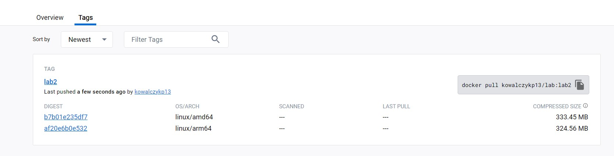

# Piotr Kowalczyk Lab2
### 1)Sprawdzanie listy workflow
Aby pobrać listę workflow zostało użyte polecenie: 

    gh workflow list
    
  

### 2)Uruchomienie workflow
Aby uruchomić workflow zostało użyte polecenie 

    gh workflow run 60270142
    

### 3)Sprawdzenie poprawności
Aby sprawdzić poprawność uruchomienia użyto polecenia:

    gh run list --workflow=lab.yml
    

### 4) Zrzut ekraniu z dodckerhub

